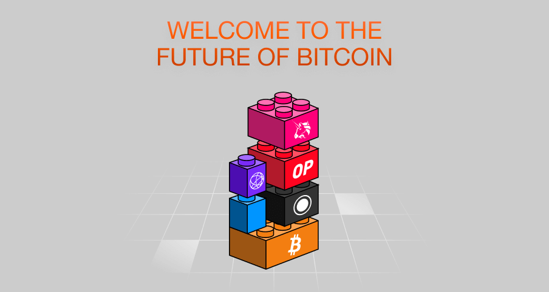

# Portal 🚀

**Portal** is a state-of-the-art dapp, merging the power of bridge, tokens manager and transaction history into one user-friendly interface. Designed with a stress on effortless user experience, it simplifies token management, making it your premier interface for interacting with both versions - every interaction smooth and efficient.

---

**Prerequisites:** Node.js version 16+, npm version 7+

---

#### L1 Balances:

By default, L1 balances are fetched via a public RPC. For faster loading speeds and reduced load on your L1 RPC provider, consider using [Ankr's RPC service](https://www.ankr.com/rpc/). Obtain an Ankr token and update the `.env` file:

```bash
ANKR_TOKEN=your_ankr_token_here
```

#### Wallet Connect Project Setup:

Before deploying your own version of the Portal, ensure you create your own Wallet Connect project on [walletconnect.com](https://walletconnect.com). After creating the project, update the project ID in the `.env` file:

```bash
WALLET_CONNECT_PROJECT_ID=your_project_id_here
```

### 🔧 Setup

Ensure you've installed the necessary dependencies:

```bash
npm install
```

### 🌐 Development Server

Activate the dev server at http://localhost:3000:

```bash
npm run dev
```

### 🏭 Production

Compile for production:

```bash
npm run generate
```

📘 Familiarize yourself with the [Nuxt 3 documentation](https://nuxt.com/docs/getting-started/introduction) for a deeper dive.

---

## 🤝 Contributing

Open arms for contributions! Enhance our code and send your pull request [here](https://github.com/matter-labs/dapp-portal/pulls).

---

## 📜 License

Proudly under the [MIT License](https://github.com/matter-labs/dapp-portal/blob/main/LICENSE).
